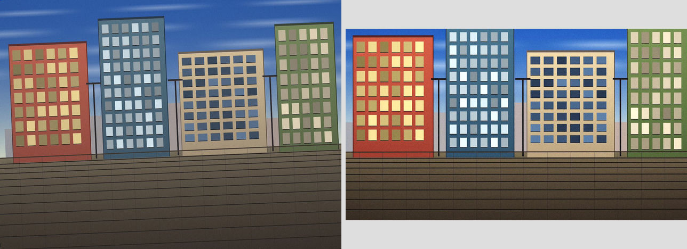

# atx-mcp

[English](README.md) | **日本語** | [简体中文](README.zh-CN.md)

[](https://glama.ai/mcp/servers/gridhra/atx-mcp)
[](https://github.com/punkpeye/awesome-mcp-servers)

汎用 AI エージェント向けの、決定論的(非生成)アセット変換 MCP サーバ。Rust 製。

編集意図(「水平にして 16:9 に整えて軽く明るく」)を宣言的な変換レシピとして実行し、
すべての結果を immutable な revision として追跡する。原本は決して変更されない。


傾き補正 + 自動レベル + ルック適用(全て決定論的レシピ)— 左: 入力 / 右: 出力

設計の全体は [docs/DESIGN.md](docs/DESIGN.md) を参照。

## ユースケース

1. **記事のアイキャッチ作成**
   > 「この写真をまっすぐにして 16:9 の 1600px アイキャッチに。WebP で」
   `import_asset` → `detect_tilt`(ほぼ水平なら AI が補正不要と判断)→ `apply_transform`(rotate→crop→resize→encode)→ `export_asset`。原本は変更されず、同じレシピはいつでも同じ結果を再現する。

2. **SNS/CMS 別サイズ展開**
   > 「この写真から OGP・Instagram 正方形・サムネを作って」
   1枚の原本から OGP 1200×630 / Instagram 1080 正方形 / サムネ 400px を並列生成。同一レシピ=同一 revision の冪等性により、何度実行しても二重生成されない。プリセット名1語の指定でも動く。

3. **公開前の安全化**
   > 「位置情報を確実に消して、色は変えないで」
   `strip_metadata`(`exif`)が GPS を含む EXIF を除去しつつ ICC プロファイルは温存する。`inspect_image` の `has_gps` を見て AI が先回りで警告することもできる。

4. **色調・ルック調整**
   > 「空の青だけもっと深く、他はそのままで」
   `curves` / `levels` / `hsl` / `white_balance`、`film_soft` プリセット、手持ちの `.cube` LUT の `import_asset`→`lut` 適用まで対応する。

5. **部分補正**
   > 「空だけ少し暗くして、地面はそのまま」
   `generate_mask`(グラデーション・輝度域・色域)でマスクを作り、マスク付きの調整を組んでから `render_preview` の `overlay:"mask"` で効き所を目視確認し、問題なければ本適用する。

6. **レイヤー合成**
   > 「同じ写真をぼかして screen 50% で重ねてふんわりさせて」
   `layers` スタックでブレンドモード16種・不透明度・マスクを組み合わせ、ソフトフォーカスのような合成を再現可能な形で組み立てる。

7. **透かし・修復・パース補正**
   > 「右下にロゴを焼き込んで、電線を消して、上すぼまりを直して」
   `svg_overlay` でロゴ焼き込み、`clone`/`heal` で質感と色調を合成してシミ・電線を除去、`perspective` で上すぼまりを補正する。

8. **書類を読む(OCR 前処理)**
   > 「このレシートの写真、読み取って」「このスライドに何て書いてある?」
   `detect_document` が用紙・画面の四角形を見つけて `perspective` にそのまま貼れる quad を返し、`ocr_document` プリセット(グレースケール → 自動レベル → 軽いシャープ)と `trim` が画素の予算を文字に集中させ、`render_preview` の `long_edge:1568` がモデルに読める大きさの画像を渡す。OCR エンジンは同梱しない: 読むのはモデル、atx は画素を読みやすく・再現可能にするだけ。`detect_text_blocks` は、その後の判断を決める問い「この文字は縮小に耐えるのか、どこで切るのか」に答える: 文字らしいブロックを読み順に返し、そのまま貼れる `crop` の帯も返す。外部 OCR エンジン向けには `threshold`(Otsu / Sauvola)と `ocr_binarize` がある。

9. **検証と説明責任**
   > 「この画像、加工前後を並べて見せて」
   `compare_revisions` が before/after を並置表示、または差分ヒートマップと数値(`mean_abs_diff` など)を返す。全 revision に系譜が残るため、記事に使った画像の加工履歴を完全に追跡・再現でき、どのマシンでもバイト同一になる。

atx にできないこと(生成的な画像編集・RAW 現像・機械学習による自動切り抜き・OCR 本体など)は対象外。ロードマップは [docs/DESIGN.md](docs/DESIGN.md) を参照。

## インストール

atx-mcp は依存のない単一バイナリ。以下のいずれかを選ぶ。

### 1. cargo binstall(ビルド済みバイナリ・コンパイルなし)

```sh
cargo binstall atx-mcp
claude mcp add --scope user asset-transform -- atx-mcp --workspace /path/to/asset-workspace
```

[`cargo-binstall`](https://github.com/cargo-bins/cargo-binstall) は、コンパイルの代わりに
本リポジトリの CI が作ったリリースアーカイブを取得する。Rust toolchain がすでにある人には
これが一番速い。(`--scope user` で全プロジェクトから利用可能になる。省略時はカレント
プロジェクト限定。)

### 2. cargo install(ソースからビルド)

```sh
cargo install atx-mcp
```

Rust toolchain が動くプラットフォームならどこでも通る(ビルド済みバイナリが無い環境も含む)。
C コンパイラも必要(libwebp をソース同梱でビルドするため)。

### 3. ビルド済みバイナリ(Rust toolchain 不要)

インストーラスクリプト(既定の設置先は `~/.local/bin`、Windows は
`%LOCALAPPDATA%\Programs\atx-mcp`。SHA256SUMS で検証してから展開する):

```sh
# macOS / Linux
curl -fsSL https://raw.githubusercontent.com/gridhra/atx-mcp/main/scripts/install.sh | sh
```

```powershell
# Windows
irm https://raw.githubusercontent.com/gridhra/atx-mcp/main/scripts/install.ps1 | iex
```

手動で落とす場合は [Releases](https://github.com/gridhra/atx-mcp/releases) から
`atx-mcp-<version>-<target>.tar.gz`(Windows は `.zip`)を取得する。提供ターゲット:

| プラットフォーム | ターゲットトリプル |
|---|---|
| macOS (Apple Silicon) | `aarch64-apple-darwin` |
| macOS (Intel) | `x86_64-apple-darwin` |
| Linux x86_64 | `x86_64-unknown-linux-musl`(静的リンク・glibc 不要) |
| Linux arm64 | `aarch64-unknown-linux-musl`(静的リンク・glibc 不要) |
| Windows x86_64 | `x86_64-pc-windows-msvc` |

```sh
claude mcp add asset-transform -- ~/.local/bin/atx-mcp --workspace /path/to/asset-workspace
```

### 4. Docker

`ghcr.io/gridhra/atx-mcp` は `FROM scratch` のイメージで、静的リンクのバイナリ以外は
何も入っていない(`linux/amd64` と `linux/arm64`)。

```sh
claude mcp add asset-transform -- \
  docker run -i --rm -v "$PWD:/workspace" ghcr.io/gridhra/atx-mcp:0.6.2
```

注意が 2 つ。**`-i` は必須**(サーバは MCP の stdio トランスポートで話すため、標準入力を
開いたままにする必要がある)。**パスはコンテナ内のパス**になる(bind mount したディレクトリは
コンテナ内では `/workspace` として見えるので、`import_asset` / `export_asset` に渡すのは
ホストのパスではなく `/workspace/photos/shot.jpg` のような形)。

### 5. npx(Node.js 18+・インストール不要)

プラットフォーム対応のネイティブバイナリが `optionalDependencies` 経由で自動的に入る。

```sh
claude mcp add --scope user asset-transform -- npx -y atx-mcp --workspace /path/to/asset-workspace
```

MCP クライアントの設定ファイルに直接書く場合:

```json
{
  "mcpServers": {
    "asset-transform": {
      "command": "npx",
      "args": ["-y", "atx-mcp", "--workspace", "/path/to/asset-workspace"]
    }
  }
}
```

---

`--workspace`(env: `ATX_WORKSPACE`)はアセットストアのディレクトリ。存在しなければ作成される。

## ツール(13)

| ツール | 役割 |
|---|---|
| `list_operations` | レシピ語彙の軽量カタログ。全 op を1行説明 + パラメータの型/値域ヒント付きで返し、末尾にビルトインプリセット名も載せる。`category:"geometry"\|"color"\|"filter"\|"output"` で絞り込み可(read-only) |
| `explain_operation` | 1つの op の完全なリファレンス。パラメータ表(型・値域・必須/既定値・意味)、そのまま貼れる JSON 例、落とし穴を返す。ビルトインプリセット名も受け取れ、その全 op 列を返す。未知の名前には有効な op 名とプリセット名を分けて返す(read-only) |
| `import_asset` | ローカル画像をワークスペースへ取り込み(sha256 冪等)。1件なら `path`、最大 64 件の一括なら `paths`(1件の失敗でバッチは止まらない)。取り込んだバイト列が既にこのワークスペースのレシピ出力だった場合は `already_derived_from` で警告 |
| `inspect_image` | 寸法・EXIF 要約・ICC・GPS 有無・輝度統計に加え、`sharpness`(ラプラシアンの分散。絶対値ではなく相対指標なので、同じ被写体の「良く撮れた1枚」と比べる)と `perceptual_hash`(dHash、16 桁 16 進。「さっきの画像と同じものか」の判定用)を返す。`include_exif:true` なら EXIF 全フィールドを `{ifd, tag, value}` で返す(GPS 座標や氏名を含みうるので既定では返さない)(read-only) |
| `detect_tilt` | Canny+Hough(粗)+ 投影プロファイル(0.1° 未満の細分)による傾き角推定。水平族/垂直族の推定も返す。スコア曲線は `include_score_curve:true` のときだけ返る。confidence 低なら「補正しない」を返す(read-only) |
| `detect_document` | Canny + 輪郭抽出で支配的な四角形(用紙・画面・ホワイトボード・看板)を検出し、`perspective` にそのまま貼れる `quad`(tl, tr, br, bl)と `confidence`・`area_ratio`・`output_size_hint`・貼り付け用 `suggested_operation` を返す。見つからないときは推測せず `quad:null` と理由(`no_quad_found` / `already_rectified` / `low_confidence`)を返す(read-only) |
| `detect_text_blocks` | Otsu 二値化 + 水平方向の run-length smearing + 連結成分で「文字らしいブロック」(見出し・段落・表・キャプション)を読み順に検出し、各ブロックの `line_count` / `median_line_height_px` / `ink_ratio` を返す。`legibility.line_height_at_1568_px` は長辺 1568 に縮めたときの行高(~16px を下回ると読めなくなる)で、`legibility.recommended_bands` はその条件を満たすように画像を横帯へ割ったもの — 各要素はそのまま `render_preview` の前に貼れる `crop` op(read-only) |
| `generate_mask` | 決定論的なグレースケールマスク(`linear_gradient` / `radial_gradient` / `luminosity_range` / `color_range`)を、参照画像と同寸法の PNG revision として生成する。op の `mask` フィールドから参照して使う(冪等) |
| `render_preview` | レシピ(または `preset`)を低解像度(既定は長辺 ≤768、`long_edge` 256..1568 で視覚モデルが文字を読める大きさまで拡大可)で適用、インライン画像付きで返却。`overlay:"grid"\|"thirds"\|"horizon"` で構図確認用のガイド線を、`overlay:"mask"`(+ `mask_revision_id`)でマスクの被覆を重ねられる(プレビューのみに描画、本適用には影響しない)。返す画像の概算 vision トークン数(`width*height/750`)を `estimated_vision_tokens` として併記する |
| `apply_transform` | レシピ(または `preset`)を高解像度適用し新 revision を発行(同一レシピ→同一 revision)。1件なら `revision_id`、同じレシピを最大 64 件へまとめて当てるなら `revision_ids` |
| `compare_revisions` | 2つの revision を長辺 ≤640 に縮小し、`layout:"side_by_side"\|"stacked"` で1枚に並べてインライン画像で返却(A/B・before/after の視覚比較用)。`layout:"diff"` なら1枚の画素差分ヒートマップ + `mean_abs_diff`/`max_abs_diff`/`changed_pixel_ratio` と `ssim`(構造的類似度)を返す(寸法が完全一致している必要あり)。どの layout でも 2 枚の dHash のハミング距離 `perceptual_hash_distance` を返す(≤5 なら同じ絵の再エンコード/リサイズ、≥20 なら別の絵) |
| `list_assets` | revision 台帳の参照(read-only) |
| `export_asset` | revision をワークスペース外へ書き出す。1件なら `revision_id` + `dest_path`、最大 64 件の一括なら `revision_ids` + `dest_dir`(ファイル名は `filename_template`、既定 `"{revision_id}.{ext}"`。`{index}` / `{stem}` も使える)。既存ファイルは `overwrite:true` 明示時のみ上書きし、ワークスペース内やシンボリックリンク越しには決して書かない |

## レシピ例

```json
{
  "operations": [
    { "op": "rotate", "angle_degrees": -1.8 },
    { "op": "crop", "aspect_ratio": "16:9" },
    { "op": "resize", "width": 1600 },
    { "op": "encode", "format": "webp", "quality": 82 }
  ]
}
```

対応 op(29種): `auto_orient` / `rotate` / `perspective` / `crop`(crop・pad)/ `trim` /
`resize`(cover・contain・fill)/ `adjust` / `color_matrix` / `curves` / `levels` / `lut` /
`white_balance` / `hsl` / `blur` / `median` / `unsharp_mask` / `convolve` / `threshold` /
`clone` / `heal` / `svg_overlay` / `flip` / `vignette` / `grain` / `gradient_map` /
`pixelate` / `auto_levels` / `encode`(jpeg・png・webp・avif)/ `strip_metadata`。
op 一覧はツールのスキーマにあえて埋め込んでいない。最新のカタログは `list_operations`、
個々の op の完全なスキーマ・例・注意点は `explain_operation` で取得する。

### LUT(.cube)

`.cube` の 3D/1D LUT は画像ではなく**アセット**である。先に取り込み、
生成された revision をレシピから参照する。

1. `.cube` ファイルを `import_asset` する。`mime_type: "application/x-cube"` の
   不変 revision として格納される(画像ではないので `inspect_image` は意図的に
   構造化エラーを返す)。
2. 返ってきた `revision_id` をレシピから参照する:

```json
{ "op": "lut", "lut_revision_id": "rev_...", "strength": 0.8 }
```

`strength`(0..1、既定 1.0)は元画像との線形ブレンド。revision は不変なので、
参照 id を `recipe_hash` に含めるだけで決定論が保たれる。一方で、そのレシピの
再現はその LUT を持つワークスペース内でのみ保証されるため、ルックを別環境へ
移すときは `.cube` ごと移すこと。存在しない id を参照した場合は、画素処理に
入る前に構造化エラーで返る。

### SVG オーバレイ(ロゴ・ウォーターマーク)

`.svg` は `.cube` LUT と同じく画像ではなく**ベクタアセット**である。先に取り込み、
生成された revision をレシピから参照してラスタ画像へ焼き込む。

1. `.svg` ファイルを `import_asset` する。`mime_type: "image/svg+xml"` の不変
   revision として格納され、サマリに SVG の**固有サイズ**が出る(`0x0` は固有サイズが
   無い = ルート `<svg>` に `viewBox` も絶対値の `width`/`height` も無い、の意)。
   ラスタ画像ではないので `inspect_image` は意図的に構造化エラーを返す。
2. 返ってきた `revision_id` をレシピから参照する:

```json
{ "op": "svg_overlay", "svg_revision_id": "rev_...",
  "x": 24, "y": 24, "width": 320, "opacity": 0.25, "blend_mode": "normal" }
```

`x` / `y` は**左上隅**の座標で、**その時点のパイプラインの画像**の座標系で解釈される
(リサイズ・クロップの後に置くこと)。負の値も指定でき、はみ出した部分はクリップされる。
`width` / `height` を両方省略すると SVG の固有サイズ、片方だけ指定すると縦横比を保って
拡縮、両方指定するとその寸法へ引き伸ばす — 固有サイズを持たない SVG は、両方を
指定しない限り構造化エラーになる。合成式とブレンドモード 16 種は
[レイヤー](#レイヤー)と完全に同じものを使う。

#### SVG 内のテキスト

atx はシステムフォントを一切読まない(インストールされているフォントはマシンごとに違い、
バイト単位の再現性を壊すため)。そのため `<text>` は、明示的に要求したときだけ描かれる:

```json
{ "op": "svg_overlay", "svg_revision_id": "rev_...", "x": 120, "y": 80,
  "width": 48, "render_text": true, "font_revision_ids": ["rev_..."] }
```

- `render_text` の既定は `false`。このときは従来と完全に同じ挙動(図形は描かれ、
  グリフは描かれず、警告が出る)。ベクタエディタでテキストをパス(アウトライン)へ
  変換しておく方法も従来どおり有効で、そちらはフォントを一切必要としない。
- `render_text:true` では**同梱の Roboto Regular 1 書体**(バイナリに埋め込み)と、
  `font_revision_ids` で渡したフォント(最大 4 件)だけで描画する。それ以外は
  何も読まないので、どのマシンでも同じ画素になる。
- フォントは LUT や SVG と同じ**アセット**である: `.ttf` / `.otf` を `import_asset`
  すると、サマリが `font-family` に書ける family 名を返す。
  **日本語(CJK)はフォントの import が必須** — Roboto に CJK グリフは無く、
  読み込んだどのフォントにも無い文字は □ で描かれ、件数が警告に出る。
  フォント revision はアセットであって画像ではないので、`inspect_image` は
  意図的に構造化エラーを返す。

### マスク(部分適用)

マスクは**グレースケールの画像 revision** である。BT.709 輝度がそのまま重みで、
白 = その op を全量適用、黒 = その画素には適用しない。トーン系・フィルタ系の 14 op
(`adjust` / `color_matrix` / `curves` / `levels` / `hsl` / `lut` / `white_balance` /
`blur` / `median` / `unsharp_mask` / `convolve` / `grain` / `gradient_map` /
`auto_levels`)が受け取れる。

1. `generate_mask` が、参照画像と**厳密に同じ寸法**のマスクを決定論的に作る:

| `kind` | パラメータ | 選択されるもの |
|---|---|---|
| `linear_gradient` | `angle_degrees`(0 = 上が白で下へ向かって黒、正で時計回り)、`start` / `end`(軸上で重みが 1→0 になる位置、0..1) | ハーフ ND(空・手前) |
| `radial_gradient` | `center_x` / `center_y`(0..1 の相対位置)、`radius`(対角線の半分に対する比 0..1)、`feather`(0..1 の追加減衰帯) | ビネット・被写体スポット |
| `luminosity_range` | `min` / `max`(0..255)、`feather`(帯の外側の減衰幅、輝度単位) | ハイライト・中間調・シャドウ |
| `color_range` | `hue_center`(0..360)、`hue_width`(片側幅 1..180)、`feather`(追加の度数) | 特定の色相域(空の青・葉の緑) |

   自前のグレースケール画像を `import_asset` して使ってもよい。

2. 返ってきた `revision_id` を op に付ける:

```json
{ "op": "curves", "master": [[0,0],[128,168],[255,255]],
  "mask": { "revision_id": "rev_...", "invert": false, "feather_px": 8.0 } }
```

   `invert`(既定 `false`)は重みを `1-w` に反転する。`feather_px`(既定 `0.0`)は
   マスク境界を、現在の画像座標でのガウス σ [px] だけぼかす。

3. `render_preview` に `overlay:"mask"` と `mask_revision_id` を渡すと、重みが 0.5 を
   超える領域を赤で、それ以外を少し暗く塗ったプレビューが返る。本適用の前に
   被覆を目視で確認できる。

マスクの参照は LUT と同じ仕組みなので、注意点も同じ: 参照 id は `recipe_hash` に
含まれ、そのレシピの再現はそのマスクを持つワークスペース内でのみ保証される。

### レイヤー

レシピは、直列の `operations` の代わりに(または併用で)`layers` スタックを
持てる。レイヤーは下から上へ合成され、各レイヤーの `ops` はまず自分のソース
に対して適用され、その結果が現在の合成結果へブレンドされる:

```json
{
  "layers": [
    { "source": "base", "ops": [] },
    {
      "source": { "revision_id": "rev_..." },
      "ops": [{ "op": "blur", "sigma": 8 }],
      "blend_mode": "multiply",
      "opacity": 0.6
    }
  ],
  "operations": [
    { "op": "resize", "width": 1600 },
    { "op": "encode", "format": "webp", "quality": 82 }
  ]
}
```

- `source` は `"base"`(`apply_transform` / `render_preview` に渡した入力
  revision)か `{"revision_id": "rev_..."}`(ワークスペース内の他の revision)
  のどちらか。全レイヤーのソースは base 画像と寸法が完全一致していなければ
  ならず、そうでなければ画素処理に入る前に構造化エラーで返る。
- `ops` は通常の operations 列で、そのレイヤーのソースだけに適用される。
- `mask` / `blend_mode`(既定 `"normal"`)/ `opacity`(既定 `1.0`)が、
  下のレイヤーへの合成のされ方を決める。
- ブレンドモードは W3C の16種のいずれか: separable 12種
  (`normal` / `multiply` / `screen` / `overlay` / `darken` / `lighten` /
  `color_dodge` / `color_burn` / `hard_light` / `soft_light` / `difference` /
  `exclusion`)に加え、non-separable 4種(`hue` / `saturation` / `color` /
  `luminosity`)。
- `layers` がある場合、トップレベルの `operations` は合成結果に対する
  **仕上げパス**になる。`resize` や最後の `encode` はここに置く
  (`encode` は従来どおり最後に1回だけ)。
- 完全なリファレンスは `explain_operation {"operation":"layers"}` を呼ぶこと。

## プリセット

プリセットはレシピの**中に** op 1つとして埋め込むこともできる —
`{"op": "preset", "name": "ocr_document"}` — ので、名前付きの処理と自分の op を組み合わせられる。
マクロは何かが動く前にその場で展開されるため、プリセットの op を手で書き出したレシピと
ハッシュが完全に一致する(`layers` を持つプリセットは展開できず、構造化エラーになる)。
規則は `explain_operation {"operation":"preset"}` で引ける。

`apply_transform` / `render_preview` は `recipe`(生の DSL)と
`preset`([`crates/atx-mcp/presets/`](crates/atx-mcp/presets) 同梱の名前付きレシピ)のどちらか一方を受ける(排他・どちらか必須):

| セット | プリセット | 内容 |
|---|---|---|
| basics | `eyecatch_16_9` | 16:9 に中央クロップ → 幅 1600px → WebP q82 |
| basics | `film_soft` | フィルム風の柔らかさ: 緩い S 字カーブ + 輝度側へ 15% の脱色 |
| basics | `product_clean` | EC 商品向けの清潔感: ほぼ中立の WB + レベル調整 + 軽いシャープ |
| basics | `thumbnail_square` | 1:1 に中央クロップ → 800x800 → WebP q80 |
| basics | `web_optimize` | 拡大せず 2000x2000 に収める → WebP q80 |
| basics | `grayscale` | BT.709 輝度の `color_matrix` による白黒化 |
| basics | `sepia` | `color_matrix` による古典的セピア |
| film | `film_warm` | 暖色系フィルム: アンバー寄り WB + 緩い S 字カーブ + 軽いグレイン |
| film | `film_cool` | 寒色系フィルム: ブルー寄り WB + 緩い S 字カーブ + 軽いグレイン |
| film | `matte_fade` | 褪色マット調: `curves` で黒を持ち上げ、わずかに脱色 |
| film | `film_grain_strong` | 緩い S 字カーブに粗く強いグレイン(増感風) |
| film | `cinema_teal_orange` | `hsl` の狙い撃ちシフトによるティール&オレンジのシネマ調 |
| mono | `bw_neutral` | BT.709 輝度の `color_matrix` による中立な白黒 |
| mono | `bw_high_contrast` | 白黒変換 + 強い S 字カーブによる高コントラスト白黒 |
| mono | `bw_red_filter` | 赤フィルターを模した白黒(空を落とす古典的手法) |
| mono | `bw_soft` | マットカーブによる柔らかく低コントラストな白黒 |
| mono | `duotone_navy_cream` | `gradient_map` によるネイビー→クリームのデュオトーン |
| editorial | `product_white` | 自動レベル伸長 + 中立 WB + 最終シャープ |
| editorial | `food_vivid` | オレンジ/イエローの彩度を上げコントラストを持ち上げる |
| editorial | `portrait_soft` | 柔らかいマットカーブ + 軽い脱色 + 控えめなビネット |
| editorial | `landscape_punch` | コントラスト・彩度の底上げ + 軽いビネット |
| editorial | `architecture_clean` | 自動レベル + シャープ + わずかな脱色(`perspective` 補正は別途手動で) |
| social | `og_1200x630` | Open Graph 用: 1200:630 にクロップ → 幅 1200 → WebP q82 |
| social | `x_wide_16_9` | X(Twitter)ワイドカード用: 16:9 にクロップ → 幅 1600 → WebP q82 |
| social | `instagram_square_1080` | Instagram 正方形投稿: 1:1 にクロップ → 1080x1080 → WebP q85 |
| social | `instagram_portrait_4_5` | Instagram 縦長投稿: 4:5 にクロップ → 1080x1350 → WebP q85 |
| social | `youtube_thumb_1280x720` | YouTube サムネイル: 16:9 にクロップ → 1280x720 → WebP q85 |
| social | `hero_2400` | 大判ヒーロー/バナー画像: 2400px に収める → WebP q85 |
| building block | `soft_vignette` | ビネット単体。他の仕上げの上に重ねる部品として |
| building block | `grain_fine` | 軽く細かい決定論的グレイン単体。重ねる部品として |
| ocr | `ocr_document` | 書類・スライド・ホワイトボード写真を視覚モデルが読める状態に: グレースケール → 自動レベル → 軽いシャープ(二値化しない) |
| ocr | `ocr_receipt` | ノイズ・退色のあるレシート向け: グレースケール → メディアン → 強めの自動レベル → シャープ |
| ocr | `ocr_binarize` | 外部 OCR エンジン向けの Sauvola 適応二値化(読み手が視覚モデルなら `ocr_document` を使う) |
| ocr | `ocr_dark_ui` | ダークモードのスクリーンショット向け: `trim` で余白を落とし、反転して黒文字・白地のグレースケールに |

プリセットは純粋な糖衣である: 解決後は通常のレシピとして同じパイプラインを流れ、
`recipe_hash`(冪等キー)は**解決後のレシピ**に対して計算される。
つまり preset 指定と、同じ内容の生レシピ指定は同一 revision に落ちる。

## 保証

- **決定論**: 同一入力 + 同一レシピ → バイト同一出力(ゴールデンテストで回帰検証)
- **冪等**: レシピは正規化(キー順ソート + f64 の 1e-6 グリッド量子化)して sha256 化。
  `(入力 revision, レシピ hash)` が同じなら既存 revision を返す
- **原本保護**: objects/ は content-addressed の追記のみ。削除・上書き API は存在しない

## 開発

```sh
cargo test --workspace     # ユニット + 統合 + プロパティ(proptest)テスト
cargo clippy --workspace --all-targets -- -D warnings
```

クレート構成: `atx-core`(レシピ・変換エンジン)/ `atx-geometry`(傾き検出)/
`atx-store`(immutable アセットストア)/ `atx-mcp`(rmcp stdio サーバ)。

ライブラリ 3 本は、crates.io では長い名前で公開している(crates.io の `atx-core` は
無関係の別プロジェクトが先に取得しているため):

| ディレクトリ | crates.io 公開名 | コード中のライブラリ名 |
|---|---|---|
| `crates/atx-core` | [`asset-transform-core`](https://crates.io/crates/asset-transform-core) | `atx_core` |
| `crates/atx-geometry` | [`asset-transform-geometry`](https://crates.io/crates/asset-transform-geometry) | `atx_geometry` |
| `crates/atx-store` | [`asset-transform-store`](https://crates.io/crates/asset-transform-store) | `atx_store` |
| `crates/atx-mcp` | [`atx-mcp`](https://crates.io/crates/atx-mcp) | `atx_mcp`(バイナリは `atx-mcp`) |

したがって変換エンジンをライブラリとして使うときは、依存に
`asset-transform-core = "0.6.2"` と書き、コードでは `use atx_core::…` と書く。

## 名前の由来

"atx" は **A**sset **T**ransform の略。末尾の `x` は "transform" の慣用的な
省略記法(xform / tx)にならったもの。短くタイプしやすいバイナリ名・ディレクトリ
接頭辞(`crates/atx-core` など)として採用しており、PC の ATX 規格や Markdown の
ATX 見出しとは関係ない。crates.io のパッケージ名は略さず綴っている
(`asset-transform-core` など)。

## ライセンス

MIT。[LICENSE](LICENSE) を参照。

バイナリに同梱している crate 以外の素材(同梱フォント Roboto Regular)の出典と
ライセンスは [THIRD_PARTY_NOTICES.md](THIRD_PARTY_NOTICES.md) に記載している。

atx-mcp が役に立ったら [コーヒーをおごって](https://buymeacoffee.com/gridhra) もらえると励みになります ☕
